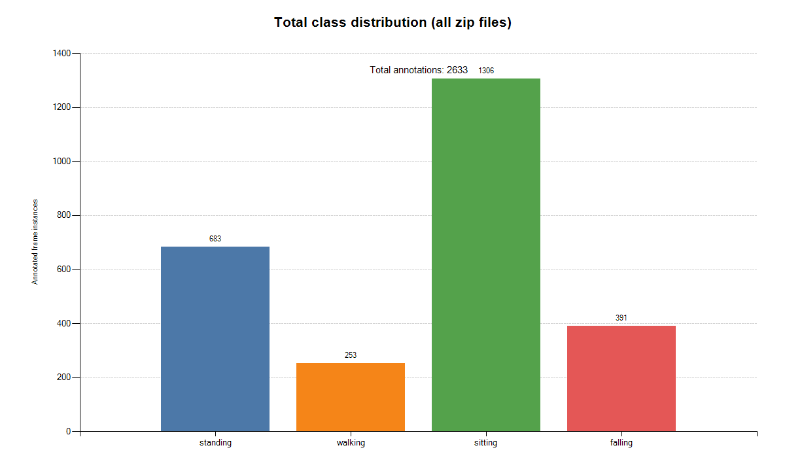

# Skeleton-Based Action Recognition (ST-GCN)

Dự án Capstone: Nhận diện 4 hành động (Standing, Walking, Sitting, Falling) dựa trên dữ liệu khung xương (Skeleton). Dữ liệu được thu thập và gán nhãn thông qua CVAT, sau đó được trích xuất dưới định dạng mảng Keypoints sử dụng mô hình học sâu đồ thị thời gian-không gian **ST-GCN** (Spatial Temporal Graph Convolutional Networks).


*(Hình ảnh phân phối các lớp dữ liệu trong hệ thống)*

## Kiến trúc Hệ Thống
1. **Tiền xử lý (Data Prep)** (`export_cvat_zips_to_stgcn.py`): Trích xuất định dạng COCO 17-joints từ Annotation của CVAT.
2. **Kiến tạo Dữ liệu (Augmentation)** (`stgcn_dataset.py`): Khắc phục hạn chế tập dữ liệu nhỏ qua thuật toán Sliding Window (Temporal Slicing), Masking, Gaussian Noise, và Flip_LR.
3. **Mô hình Mạng ST-GCN** (`stgcn_model.py`): Huấn luyện dựa trên Checkpoint Pre-trained từ MMAction2. Đi kèm Focal Loss & WeightedRandomSampler chống lệch phân phối dữ liệu (Imbalanced Mitigation).
4. **Huấn luyện (Training & Eval)** (`train_stgcn.py`): Hệ thống đào tạo dựa trên kỹ thuật đánh giá chéo 5-Folds (K-fold Cross Validation) và đăng xuất số liệu đồ thị lên `Weights & Biases (WandB)`. 
5. **Inference & Demo** (Thư mục `Demo/`): Source Code thu gọn phục vụ ráp ghép đường ống (Pipeline) cho các ứng dụng thực tế bằng Webcam hoặc CCTV.

## Hướng dẫn Run Demo Nhanh

Toàn bộ API dự đoán đã được nén vào thư mục `Demo`. Để thử nghiệm kết quả của hệ thống, chỉ cần:

```bash
cd Demo
pip install torch numpy
python inference_demo.py
```
> Trong script `inference_demo.py` có hướng dẫn cách đưa dữ liệu Tensor (Batch, 3 Channel Toạ độ, 100 Frames, 17 Khớp COCO) thu thập từ Camera thực tiễn vào hàm suy luận (Predict). Thư mục `Demo` bao gồm sẵn file Trọng số (`best_model.pth`) cùng thuật toán độc lập. Tốc độ nhận diện nhanh, khả năng Tracking thời gian thực.

## Huấn luyện Lại (Re-Train)
Nếu có bộ dữ liệu lớn hơn hoặc muốn tuỳ biến:
```bash
python train_stgcn.py --pretrained "stgcn_ntu60.pth" --oversample --loss-type focal
```
